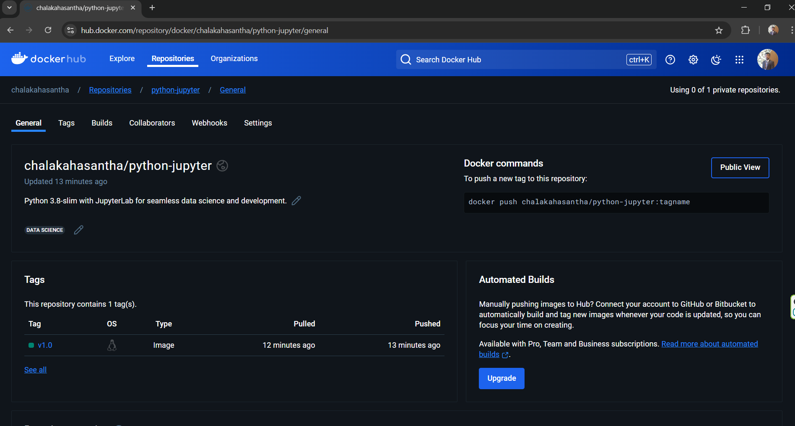

# Docker Image Push Guide

This guide provides step-by-step instructions to push your custom Docker image to Docker Hub. By following these steps, you will be able to share your Docker images publicly or privately via Docker Hub.

## Prerequisites

- Docker must be installed on your machine.
- You must have a Docker Hub account. If you don’t have one, you can create it at [Docker Hub](https://hub.docker.com/).

## Steps to Push a Docker Image to Docker Hub

### Step 1: Log in to Docker Hub

Before you can push your image to Docker Hub, you need to authenticate your Docker client with Docker Hub. Use the following command to log in:

```bash
docker login
```

After running this command, you will be prompted to enter your Docker Hub username and password. Once logged in successfully, you should see a confirmation message indicating that the login was successful.


### Step 2: Tag Your Docker Image

Docker images need to be tagged with a specific name and version that identifies the image on Docker Hub. The tag should include your Docker Hub username, the repository name, and the image version.

Use the following command to tag your Docker image:

```bash
docker tag python-jupyter chalakahasantha/python-jupyter:v1.0
```

- `python-jupyter` is the name of your local Docker image.
- `chalakahasantha/python-jupyter:v1.0` is the new tag, where `chalakahasantha` is your Docker Hub username, `python-jupyter` is the repository name, and `v1.0` is the version tag.


### Step 3: Push Your Docker Image to Docker Hub

Now that your image is tagged correctly, you can push it to Docker Hub using the following command:

```bash
docker push chalakahasantha/python-jupyter:v1.0
```


This command uploads your Docker image to Docker Hub under your account in the `chalakahasantha/python-jupyter` repository with the `v1.0` tag.


This command uploads your Docker image to Docker Hub under your account in the `chalakahasantha/python-jupyter` repository with the `v1.0` tag.

### Pulling the Docker Image

Anyone who wants to use your Docker image can pull it from Docker Hub using the following command:

```bash
docker pull chalakahasantha/python-jupyter:v1.0
```

This command downloads the `chalakahasantha/python-jupyter:v1.0` Docker image to their local machine.


### Verify the Image on Docker Hub

Once the image is successfully pushed, you can verify its presence by logging in to Docker Hub and navigating to your repository. Your Docker image should be listed there with the specified tag.

